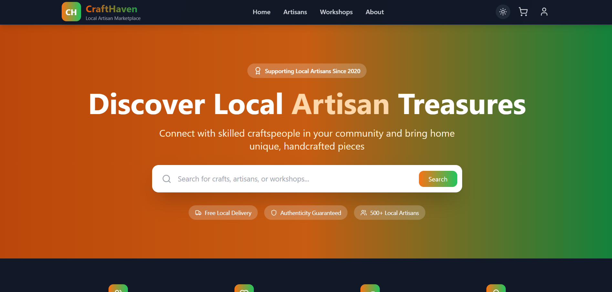
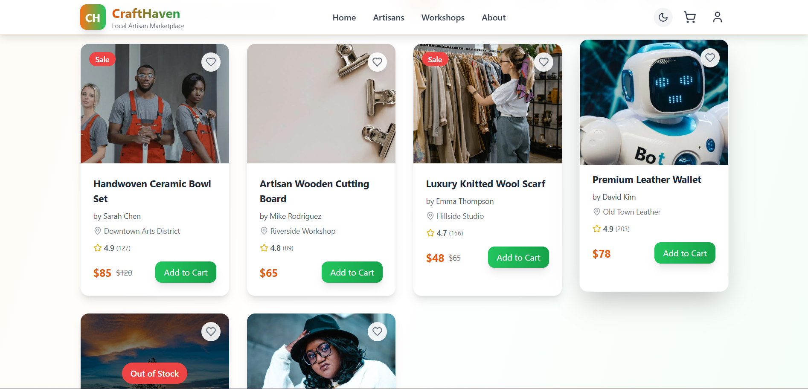

# 🛍️ CraftHaven

CraftHaven is a full-stack e-commerce platform built to empower local artisans by providing them with a digital space to showcase and sell their handcrafted products.

## 📌 Features

- 🖼️ Artisan product listing with images, names, and prices
- 🛒 Add to cart and checkout functionality
- 🔍 Filter and search through artisan-made products
- 💡 Clean, responsive UI using modern frontend tools
- 🌐 Scalable architecture for future backend integration

## 🚀 Tech Stack

- **Frontend:** HTML, CSS, JavaScript, React, Vite
- **Styling:** Tailwind CSS
- **State Management:** React Hooks
- **Backend (In progress):** Node.js, Express, MongoDB

## ⚙️ Deployment (Recommended)

Quick deploy setup I recommend for a resume:

- Frontend: Vercel (connect GitHub, auto-deploy, supports Vite)
- Backend: Render (connect GitHub, set env vars, health check)
- Database: MongoDB Atlas

Steps to deploy:

1. Push this repo to GitHub (create a new repository and push `main`).
2. Frontend (Vercel):
	- Import project -> `frontend` folder
	- Build command: `npm run build`
	- Output directory: `dist`
	- Set env var `VITE_API_URL` to your backend URL
3. Backend (Render):
	- Create a new Web Service, link this GitHub repo
	- Root: `backend` folder
	- Start command: `npm start`
	- Add env vars: `MONGO_URI`, `JWT_SECRET`, `NODE_ENV=production`
	- Health check path: `/api/health`
4. Add secrets on GitHub if you want auto-deploys via Actions (Vercel token, etc.).

Files added to help deploy: `backend/Dockerfile`, `backend/Procfile`,
`.github/workflows/frontend-deploy.yml`, and `.github/workflows/backend-ci.yml`.

I can finish the GitHub push and connect Vercel/Render if you give me repo access, or I can walk you through the exact clicks to connect them — which do you prefer?

## 📸 Screenshots

> 
> 